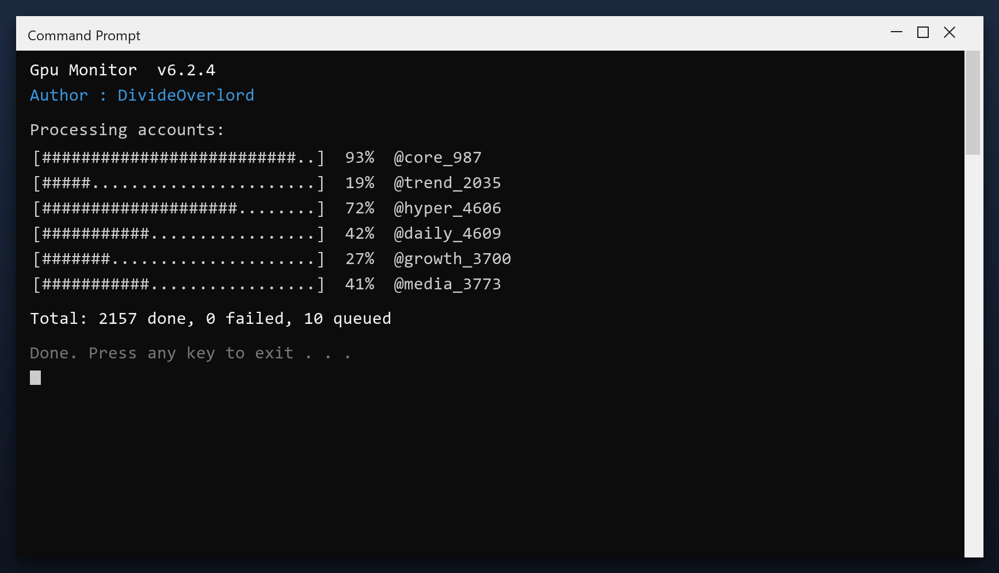

# Gpu Monitor : téléchargement gratuit et guide d'installation (2026)

  

  

**Gpu monitor** est l'un des outils les plus téléchargés en 2026. **Totalement gratuit. Sans inscription. Sans frais cachés.**

  

> **Important :** l'antivirus peut signaler le fichier — c'est un faux positif. Le build est testé et propre. Ajoutez une exception ou désactivez la protection.

<b>❓ What is Gpu Monitor?</b>

Gpu monitor est un outil populaire utilisé par des millions de personnes chaque mois. La version actuelle est plus rapide et légère que les précédentes et fonctionne sur tous les systèmes modernes.

| **Terme** | **Explication** |
| --- | --- |
| **Version complète** | Toutes les fonctions |
| **Portable** | Fonctionne sans installation |
| **Build 2026** | Dernière version |

<b>❌ The problem it solves</b>

- **Versions payantes** – les meilleures fonctions coûtent cher
- **Limites d'essai** – la plupart expirent après 30 jours
- **Faux téléchargements** – beaucoup de sites proposent des fichiers modifiés
- **Vieilles versions** – difficile de trouver la bonne

<b>✅ How it solves it</b>

| **Problème** | **Solution** |
| --- | --- |
| **Versions payantes** | Version complète gratuite |
| **Limites d'essai** | Sans expiration |
| **Faux fichiers** | Build testé sur cette page |
| **Vieilles versions** | Dernière version 2026 |

<b>⚡ Quick start</b>

1. **Télécharger** – cliquez sur le bouton vert ci-dessous
2. **Préparer** – désactivez temporairement l'antivirus
3. **Exécuter** – lancez le fichier en administrateur
4. **Terminé** – le programme est prêt

<b>🎯 Key features</b>

| **Fonctionnalité** | **Détails** |
| --- | --- |
| **Version** | Dernière 2026 |
| **Plateformes** | Windows 10/11, macOS |
| **Prix** | Gratuit |
| **Installation** | Moins de deux minutes |
| **Langues** | Multilingue |
| **Hors ligne** | Après installation |

<b>📦 What's included</b>

| **Composant** | **Détails** |
| --- | --- |
| **Programme** | Dernière version 2026 |
| **Guide** | Étapes d'installation |
| **Conseils** | Recommandations |
| **FAQ** | Questions courantes |

<b>📋 System requirements</b>

| **Composant** | **Minimum** | **Recommandé** |
| --- | --- | --- |
| **OS** | Windows 10 | Windows 11 (64 bits) |
| **RAM** | 4 Go | 8 Go |
| **Disque** | 500 Mo | 2 Go |
| **Réseau** | Téléchargement | Mises à jour |

<b>📊 Why Gpu Monitor</b>

| **Fonctionnalité** | **Alternatives** | **gpu monitor** |
| --- | --- | --- |
| **Prix** | Souvent payant | Gratuit |
| **Mises à jour** | Rares | Régulières |
| **Installation** | Compliquée | Deux minutes |
| **Support** | Aucun | FAQ |

<b>💡 Tips</b>

- Fermez les autres programmes avant l'installation
- Redémarrez après l'installation
- Gardez l'installeur
- Vérifiez les mises à jour chaque mois

<b>⚠️ Known issues & fixes</b>

| **Problème** | **Solution** |
| --- | --- |
| **Téléchargement bloqué** | Confirmez dans le navigateur |
| **Installation échouée** | Exécutez en administrateur |
| **Ne démarre pas** | Redémarrez le PC |
| **Alerte antivirus** | Faux positif — ajoutez une exception |

<b>❓ FAQ</b>

**Gpu monitor est-il gratuit ?**

Oui — la version complète est gratuite.

**Est-ce sûr ?**

Oui — le build est analysé et testé. Les alertes antivirus sont souvent des faux positifs.

**Fonctionne-t-il sur mon PC ?**

Windows 10/11, macOS 12+ avec 4 Go de RAM — voir la config ci-dessus.

**Comment l'installer ?**

Quatre étapes dans Démarrage rapide — environ deux minutes.

**Où est le lien ?**

Le bouton vert dans la section Démarrage rapide.

---

*pristine-obsidian-143 · Mis à jour 2026-10-09 · Partagé sous licence MIT*

## Related topics

- [quick-gpu-monitor](https://github.com/topics/quick-gpu-monitor)
- [easy-ping-reducer-open-source](https://github.com/topics/easy-ping-reducer-open-source)
- [quick-lag-reducer-download](https://github.com/topics/quick-lag-reducer-download)
- [how-to-fan-control-tool-open-source](https://github.com/topics/how-to-fan-control-tool-open-source)
- [best-task-scheduler-gui-software](https://github.com/topics/best-task-scheduler-gui-software)
- [battery-health-checker-download](https://github.com/topics/battery-health-checker-download)
- [pro-registry-cleaner-toolkit](https://github.com/topics/pro-registry-cleaner-toolkit)
- [hardware-monitor-utility](https://github.com/topics/hardware-monitor-utility)
